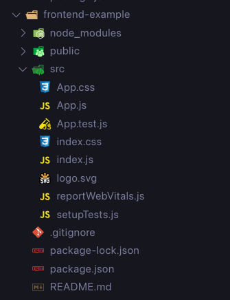

# <span style="color:#ADD8E6">Creating your first MERN App - Part 2</span>

<div align="right"> </div>

## <span style="color:#ADD8E6">Table of Contents </span>

- [Description](#desc)
- [Prerequisites](#pre)
- [Implementing the App](#impl)
  - [Database](#db)
  - [Backend](#back)
  - [Frontend](#front)
    - [The UI](#ui)
    - [Fetching Data](#data)
- [Your Task](#task)

<a id="desc"></a>

## <span style="color:#ADD8E6"> Description </span>

This is the second half of the two-part lab you started last week (Lab 2) where you built the backend server for our amazing note taking app (✨). The idea behind this lab is to build upon the previous lab where we only had a WebAPI communicating with our database, but now we want to add the final layer to our 3-tier client-server architecture, i.e. the "client" or the frontend. We will walk through to design a basic UI for our app and then we with use the `fetch` API to retrieve and/or modify data from our backend (from lab 2) and update our page accordingly. As mentioned last week, we will use **ReactJS** as our choice of frontend framework.

Note: You should already be familiar with a lot of the syntax and behaviors we see in the following sections from Lab 1 where we used React Native to build a mobile application, since ReactJS is only just the "web equivalent" of React Native to put it in simple terms.

Please refer to the officials docs and API references for more information:

- https://react.dev/reference/react

If there are any issues or inaccuracies, please contribute by raising issues, making pull requests, or asking on Piazza. Thanks!

<a id="pre"></a>

## <span style="color:#ADD8E6"> Prerequisites </span>

These are the exact same as what you needed for lab 2. Nothing new is required.

1. Make sure you have Node.js installed. You can install from the official website: https://nodejs.org/en/download/. **Please make sure you are running Node version 14.0.0 or higher and npm version 5.6 or higher**.
2. We will be using a local MongoDB database, refer to this link for a quick tutorial to install MongoDB on most platform: https://www.prisma.io/dataguide/mongodb/setting-up-a-local-mongodb-database#setting-up-mongodb-on-windows
3. An HTTP client to craft HTTP requests. We will use Postman. You can download Postman here: https://www.postman.com/downloads/. (This is optional this time around, but highly recommended to test your endpoints before integrating with your frontend)
4. An IDE. We will use VS Code.

<a id="impl"></a>

## <span style="color:#ADD8E6"> Implementing the App </span>

Initialize a new GitHub repo named appropriately, and clone it locally. This repo includes starter code (available within the `backend` and `frontend` folder) that will be used for the lab, but we will teach you how to recreate this **frontend** starter code from scratch throughout the rest of this `README` file. You are free to grab the backend folder from this repo and follow along with the rest of this demo to complete the frontend. Make sure you have a look through the endpoints inside `server.js` to get a refresher from last week and see what's available to use.

Before we begin writing our frontend code, lets first run and test our backend server to make sure everything is setup correctly. You should be familiar with these steps from last week:

<a id="db"></a>

### Database

Navigate to the root of your project and run `cd backend`. Run `npm install` or `npm i` to install all required dependencies. While you're waiting, open a new terminal window/tab and navigate to the same directory. Now create a new directory `data` and another directory inside `data` named `db` by running:

```bash
mkdir data
mkdir data/db
```

Now run:

```bash
mongod --dbpath=./data/db
```

To get your database server running. Note: Make sure to kill any global instances of `mongod` by running `sudo service mongod stop` or your OS equivalent, since this can prevent you from running a local instance.

<a id="back"></a>

### Backend

Now navigate back to your backend terminal, once all the dependencies have finished installing run: `npm run dev`. Once you see the following output, you should be good to go:


You can now run Postman and test out the endpoints provided in `server.js`.

Now we will start building our frontend.

<a id="front"></a>

### Frontend

Remember the finished frontend starter code to the end of this tutorial is provided to you inside the `frontend` directory. If you feel confident and understand this code feel free to start working on top of it. But in this tutorial we will walk you through building the frontend from scratch.

Navigate to the root of your project and create a new directory named `frontend-example`. We will only work inside this folder for the rest of the tutorial. Run `cd frontend-example` to navigate to the frontend directory.

Now run:

```bash
npx create-react-app .
```

Once completed this create a new React app within our current directory and install the required dependencies. Run `code .` to open up the project in VSCode and look through the files created.



All the application/component code lives under the `src/` directory. Lets start by deleting some unnecessary files. Delete everything under `src/`, except for `App.js, App.css, index.js, index.css`. You file structure so far should look like this:


Lastly, inside your `index.js` remove the following lines:

```javascript
import reportWebVitals from "./reportWebVitals";
```

```javascript
// If you want to start measuring performance in your app, pass a function
// to log results (for example: reportWebVitals(console.log))
// or send to an analytics endpoint. Learn more: https://bit.ly/CRA-vitals
reportWebVitals();
```

Finally, time to write some code 💖...

<a id="ui"></a>

### The UI

Let's start by building the UI for our application. This is not our focus for this lab so we will move fairly quickly here. Firstly create a file under `src` named `Note.js`. This will be our Note component. Paste the following code inside this file:

```javascript
import "./App.css";

const Note = ({ entry, editNote, deleteNote }) => {
  return (
    <div style={NoteStyle.note}>
      <p style={NoteStyle.text}>{entry.title}</p>
      <button onClick={() => editNote(entry)}>Edit note</button>
      {<button onClick={() => deleteNote(entry)}>Delete note</button>}
    </div>
  );
};

export default Note;

const NoteStyle = {
  note: {
    padding: "20px",
    margin: "20px",
    width: "200px",
    borderStyle: "dotted",
    borderRadius: "30px",
    borderWidth: "thin",
    overflowWrap: "break-word",
  },
  text: {
    margin: "0px",
  },
};
```

This component represents a note with a title, an edit button, and a delete button. The Note component takes three props: entry, editNote, and deleteNote. The entry prop represents the note data, while editNote and deleteNote are functions to handle editing and deleting the note, respectively. These will be passed into the Note as props when we add a new Note to our App.

The note is displayed inside a div with styling defined in the NoteStyle object. The note has a title displayed as a paragraph (`<p>`), and two buttons - one for editing and one for deleting the note. The editNote and deleteNote functions are called with the entry prop when the corresponding buttons are clicked.

The NoteStyle object contains defines some basic styling for this component.

Now let's try to display a singular Note component onto our page. Head over to `App.js` and paste the following code:

```javascript
import React, { useState, useEffect } from "react";
import "./App.css";
import Note from "./Note";

function App() {
  const entry = {
    _id: "5f6e3d9d2e3d2f2f2f2f2f2f",
    title: "This is a note",
    content: "This is the content of the note",
  };

  const editNote = () => {
    console.log("edit note");
  };

  const deleteNote = () => {
    console.log("delete note");
  };

  return (
    <div className="App">
      <header className="App-header">
        <Note entry={entry} editNote={editNote} deleteNote={deleteNote} />
      </header>
    </div>
  );
}

export default App;
```

Here we are simply creating a dummy note with some mock data and displaying a singular note onto our main page. We are also passing in dummy edit and delete function which simply print a message to the console. Let's test this app. Head over to your terminal window in the `frontend-example` directory and run `npm run start`. This should automatically open up a browser window and navigate to `http://localhost:3000`. You should see the following:


Note: On Chrome you can press Ctrl+Shift+I to view the developer tools and head over to the Console tab. Now if you press the, "Edit Note" or "Delete Note" buttons you should see the output on the console.

Alright so we have the basic UI setup. Now we will learn to fetch data from our backend and dynamically update our frontend. Let's keep the frontend server running (it will auto update on changes). Make sure your backend and database are also running as mentioned in the previous steps.

Let's add a few more divs and give the App a bit more structure before we move on:

```javascript
import { useState } from "react";
import "./App.css";
import Note from "./Note";

function App() {
  // -- Backend-related state --
  const [loading, setLoading] = useState(true);

  const entry = {
    _id: "5f6e3d9d2e3d2f2f2f2f2f2f",
    title: "This is a note",
    content: "This is the content of the note",
  };

  const editNote = () => {
    console.log("edit note");
  };

  const deleteNote = () => {
    console.log("delete note");
  };

  return (
    <div className="App">
      <header className="App-header">
        <h1 style={AppStyle.title}>QuirkNotes</h1>
        <h4 style={AppStyle.text}>The best note-taking app ever </h4>

        <div style={AppStyle.notesSection}>
          {loading ? (
            <>Loading...</>
          ) : (
            <Note entry={entry} editNote={editNote} deleteNote={deleteNote} />
          )}
        </div>
      </header>
    </div>
  );
}

const AppStyle = {
  dimBackground: {
    opacity: "20%",
    pointerEvents: "none",
  },
  notesSection: {
    display: "flex",
    flexWrap: "wrap",
    justifyContent: "center",
  },
};

export default App;
```

Since our data will depend on the backend server, we are using the `loading` state variable to display a "loading" message in case we are in the process of fetching data.

<a id="data"></a>

### Fetching Data

Now up to the previous step, we hardcoded a Note component onto our screen with some dummy data. And initialized a loading state starting at True. At this point screen will display "Loading..." forever. Now our goal to dynamically fetch all notes from our backend and display them in the frontend while setting the loading state to False. Firstly lets initialize a state variable to store all our notes alongside the loading state variable:

```javascript
const [notes, setNotes] = useState(undefined);
```

We will now write our "fetching" logic inside a useEffect hook. Paste the following below your state definitions:

```javascript
// -- Database interaction functions --
useEffect(() => {
  const getNotes = async () => {
    try {
      await fetch("http://localhost:4000/getAllNotes").then(
        async (response) => {
          if (!response.ok) {
            console.log("Served failed:", response.status);
          } else {
            await response.json().then((data) => {
              getNoteState(data.response);
            });
          }
        }
      );
    } catch (error) {
      console.log("Fetch function failed:", error);
    } finally {
      setLoading(false);
    }
  };

  getNotes();
}, []);
```

Things to note from this:

- The useEffect hook is used to perform side effects in a functional component. It takes a function as its first argument, which will be executed after the component is rendered.

- Inside the useEffect, there is an asynchronous function called getNotes.

- getNotes uses the fetch function to make a GET request to "http://localhost:4000/getAllNotes". This assumes that there is an API endpoint at that URL that returns a list of notes. This endpoint is defined in our backend.

- The fetch function returns a Promise, and the then method is used to handle the response asynchronously.

- Inside the first then block, it checks if the response is OK (status code 200). If it's not OK, it logs an error message with the response status. If it's OK, it proceeds to the next then block.

- In the second then block, it converts the response to JSON using response.json(). This also returns a Promise, so another then block is used to handle the actual data.

- Inside the third then block, the data is passed to the getNoteState function. This function is assumed to be a state-setting function that updates the component's state with the retrieved notes.

- If any errors occur during the fetch operation, they are caught in the catch block, and an error message is logged.

- The finally block sets the component's loading state to false.

- Finally, the getNotes function is called immediately after the component mounts, thanks to the useEffect hook's dependency array [], which means it will only run once after the initial render.

Finally add this block below the useEffect:

```javascript
// -- State modification functions --
const getNoteState = (data) => {
  setNotes(data);
};
```

Now if you reload your page, you shouldn't see any difference since haven't yet modified our App's DOM with the fetched data. Now under the noteSection div of our App lets replace the hardcoded Note component with a mapping of the notes within our state variable onto the DOM like so:

```javascript
<div style={AppStyle.notesSection}>
  {loading ? (
    <>Loading...</>
  ) : notes ? (
    notes.map((entry) => {
      return (
        <div key={entry._id}>
          <Note entry={entry} editNote={editNote} deleteNote={deleteNote} />
        </div>
      );
    })
  ) : (
    <div style={AppStyle.notesError}>
      Something has gone horribly wrong! We can't get the notes!
    </div>
  )}
</div>
```

This will map each entry inside our notes variable onto a Note component on our page, if the notes variable is empty, it means we are still fetching our data then "Loading..." will be displayed on the screen.

This is what your App.js should look like upto this point:

```javascript
import { useState, useEffect } from "react";
import "./App.css";
import Note from "./Note";

function App() {
  // -- Backend-related state --
  const [loading, setLoading] = useState(true);
  const [notes, setNotes] = useState(undefined);

  const entry = {
    _id: "5f6e3d9d2e3d2f2f2f2f2f2f",
    title: "This is a note",
    content: "This is the content of the note",
  };

  const editNote = () => {
    console.log("edit note");
  };

  const deleteNote = () => {
    console.log("delete note");
  };

  // -- Database interaction functions --
  useEffect(() => {
    const getNotes = async () => {
      try {
        await fetch("http://localhost:4000/getAllNotes").then(
          async (response) => {
            if (!response.ok) {
              console.log("Served failed:", response.status);
            } else {
              await response.json().then((data) => {
                getNoteState(data.response);
              });
            }
          }
        );
      } catch (error) {
        console.log("Fetch function failed:", error);
      } finally {
        setLoading(false);
      }
    };

    getNotes();
  }, []);

  // -- State modification functions --
  const getNoteState = (data) => {
    setNotes(data);
  };

  return (
    <div className="App">
      <header className="App-header">
        <h1 style={AppStyle.title}>QuirkNotes</h1>
        <h4 style={AppStyle.text}>The best note-taking app ever </h4>

        <div style={AppStyle.notesSection}>
          {loading ? (
            <>Loading...</>
          ) : notes ? (
            notes.map((entry) => {
              return (
                <div key={entry._id}>
                  <Note
                    entry={entry}
                    editNote={editNote}
                    deleteNote={deleteNote}
                  />
                </div>
              );
            })
          ) : (
            <div style={AppStyle.notesError}>
              Something has gone horribly wrong! We can't get the notes!
            </div>
          )}
        </div>
      </header>
    </div>
  );
}

const AppStyle = {
  dimBackground: {
    opacity: "20%",
    pointerEvents: "none",
  },
  notesSection: {
    display: "flex",
    flexWrap: "wrap",
    justifyContent: "center",
  },
};

export default App;
```

Now if you refresh your page you should be able to see some notes, if you previously added some notes to your database, if not, you should see no notes on the screen. You can test by adding some new notes using Postman hitting the `/postNote/` endpoint with some data. And you should be able to see this note on your frontend if the request goes through successfully.

We can now implement the logic for posting new notes within our frontend. To accomplish this we will need a Modal or a Dialog Box to enter data and use this to send data to our POST endpoint. Let's create a new component named `Dialog.js` with the following contents:

```javascript
import React, { useState, useEffect } from "react";
import "./App.css";

const baseNote = { title: "", content: "" };

function Dialog({ open, initialNote, closeDialog, postNote: postNoteState }) {
  // -- Dialog props --
  const [note, setNote] = useState(baseNote);
  const [status, setStatus] = useState("");

  // -- Dialog functions --
  useEffect(() => {
    !initialNote && setNote(baseNote);
    initialNote && setNote(initialNote);
  }, [initialNote]);

  const close = () => {
    setStatus("");
    setNote(baseNote);
    closeDialog();
  };

  // -- Database interaction functions --
  const postNote = async () => {
    if (!note || !note.title || !note.content) {
      return;
    }

    setStatus("Loading...");

    try {
      await fetch("http://localhost:4000/postNote", {
        method: "POST",
        headers: {
          "Content-Type": "application/json",
        },
        body: JSON.stringify({ title: note.title, content: note.content }),
      }).then(async (response) => {
        if (!response.ok) {
          setStatus(`Error trying to post note`);
          console.log("Served failed:", response.status);
        } else {
          await response.json().then((data) => {
            postNoteState(data.insertedId, note.title, note.content);
            //setStatus("Note posted!") // Can be replaced with close(), if you want!
            close();
          });
        }
      });
    } catch (error) {
      setStatus("Error trying to post note");
      console.log("Fetch function failed:", error);
    }
  };

  const patchNote = (entry) => {
    // Code for PATCH here
  };

  return (
    <dialog open={open} style={DialogStyle.dialog}>
      <input
        placeholder="Your note title goes here!"
        type="text"
        value={note.title}
        maxLength={30}
        style={DialogStyle.title}
        onChange={(e) => setNote({ ...note, title: e.target.value })}
      />
      <textarea
        placeholder="Your note content goes here!"
        value={note.content}
        rows={5}
        style={DialogStyle.content}
        onChange={(e) => setNote({ ...note, content: e.target.value })}
      />
      <div style={DialogStyle.buttonWrapper}>
        <button
          onClick={initialNote ? patchNote : postNote}
          disabled={!note.title || !note.content}
        >
          {initialNote ? "Patch Note" : "Post Note"}
        </button>
        {status}
        <button style={DialogStyle.closeButton} onClick={() => close()}>
          Close
        </button>
      </div>
    </dialog>
  );
}

export default Dialog;

const DialogStyle = {
  dialog: { width: "75%" },
  title: {
    fontSize: "40px",
    display: "block",
    width: "100%",
  },
  content: {
    fontSize: "20px",
    display: "block",
    width: "100%",
  },
  buttonWrapper: {
    display: "flex",
    justifyContent: "space-between",
    gap: "10px",
  },
  closeButton: { justifySelf: "end" },
};
```

This code defines a React component named Dialog that represents a dialog box for creating or editing notes. The dialog allows users to input a title and content for a note and provides buttons for posting (creating) or patching (editing) a note. Note that the editing functionality is not yet implemented. The component communicates with a backend API to interact with the database for posting and editing notes. The dialog can be opened or closed based on the open prop, and it receives initial note data through the initialNote prop when in edit mode. The styling for the dialog and its components is defined using the `DialogStyle` object. Head back over to your `App.js`.

Add the following to the bottom of the your JSX:

```javascript
<button onClick={postNote}>Post Note</button>;
{
  notes && notes.length > 0 && (
    <button onClick={deleteAllNotes}>Delete All Notes</button>
  );
}
```

Under the noteSection div. This will create two new buttons, Post Note and Delete All Notes. Note: The delete button will only show up when there are any notes to be deleted (duh). i.e. `notes.length > 0`.

Add the following below the noteSection div to mount a Dialog component to our page:

```javascript
<Dialog
  open={dialogOpen}
  initialNote={dialogNote}
  closeDialog={closeDialog}
  postNote={postNoteState}
  // patchNote={patchNoteState}
/>
```

We will now create a few more state functions along with a state variable for opening/closing the Dialog. App.js should now look as follows:

```javascript
import React, { useState, useEffect } from "react";
import "./App.css";
import Dialog from "./Dialog";
import Note from "./Note";

function App() {
  // -- Backend-related state --
  const [loading, setLoading] = useState(true);
  const [notes, setNotes] = useState(undefined);

  // -- Dialog props--
  const [dialogOpen, setDialogOpen] = useState(false);
  const [dialogNote, setDialogNote] = useState(null);

  // -- Database interaction functions --
  useEffect(() => {
    const getNotes = async () => {
      try {
        await fetch("http://localhost:4000/getAllNotes").then(
          async (response) => {
            if (!response.ok) {
              console.log("Served failed:", response.status);
            } else {
              await response.json().then((data) => {
                getNoteState(data.response);
              });
            }
          }
        );
      } catch (error) {
        console.log("Fetch function failed:", error);
      } finally {
        setLoading(false);
      }
    };

    getNotes();
  }, []);

  const deleteNote = (entry) => {
    // Code for DELETE here
  };

  const deleteAllNotes = () => {
    // Code for DELETE all notes here
  };

  // -- Dialog functions --
  const editNote = (entry) => {
    setDialogNote(entry);
    setDialogOpen(true);
  };

  const postNote = () => {
    setDialogNote(null);
    setDialogOpen(true);
  };

  const closeDialog = () => {
    setDialogNote(null);
    setDialogOpen(false);
  };

  // -- State modification functions --
  const getNoteState = (data) => {
    setNotes(data);
  };

  const postNoteState = (_id, title, content) => {
    setNotes((prevNotes) => [...prevNotes, { _id, title, content }]);
  };

  const deleteNoteState = () => {
    // Code for modifying state after DELETE here
  };

  const deleteAllNotesState = () => {
    // Code for modifying state after DELETE all here
  };

  const patchNoteState = (_id, title, content) => {
    // Code for modifying state after PATCH here
  };

  return (
    <div className="App">
      <header className="App-header">
        <div style={dialogOpen ? AppStyle.dimBackground : {}}>
          <h1 style={AppStyle.title}>QuirkNotes</h1>
          <h4 style={AppStyle.text}>The best note-taking app ever </h4>

          <div style={AppStyle.notesSection}>
            {loading ? (
              <>Loading...</>
            ) : notes ? (
              notes.map((entry) => {
                return (
                  <div key={entry._id}>
                    <Note
                      entry={entry}
                      editNote={editNote}
                      deleteNote={deleteNote}
                    />
                  </div>
                );
              })
            ) : (
              <div style={AppStyle.notesError}>
                Something has gone horribly wrong! We can't get the notes!
              </div>
            )}
          </div>

          <button onClick={postNote}>Post Note</button>
          {notes && notes.length > 0 && (
            <button onClick={deleteAllNotes}>Delete All Notes</button>
          )}
        </div>

        <Dialog
          open={dialogOpen}
          initialNote={dialogNote}
          closeDialog={closeDialog}
          postNote={postNoteState}
          // patchNote={patchNoteState}
        />
      </header>
    </div>
  );
}

export default App;

const AppStyle = {
  dimBackground: {
    opacity: "20%",
    pointerEvents: "none",
  },
  notesSection: {
    display: "flex",
    flexWrap: "wrap",
    justifyContent: "center",
  },
  notesError: { color: "red" },
  title: {
    margin: "0px",
  },
  text: {
    margin: "0px",
  },
};
```

We are kinda rushing over a lot of complex logic for handling open/closing of the Dialog component but this is not really in the scope of this lab.

At this point you should see a Post Note button your screen (and a Delete All Notes button if you have existing notes on the screen). The Post Note button calls the postNote function onClick which then opens up the Dialog box by updating its state. The Dialog component takes in a function postNoteState as a prop, this function is only used by Dialog to communicate with the App when a new note is posted (i.e. to update the page). The Dialog component then handles the logic for posting a new note by sending a POST request to our backend for adding a new note with the provided data in the text boxes.

Now on your app you should be able to post a new note, and this should add a note to your database i.e. if you refresh, the changes are persistent.

And that's all! Congrats, you have now successfully built a full-stack web application from scratch using the 3-tier model :)

<a id="task"></a>

## <span style="color:#ADD8E6"> Your Task </span>

Your task in this lab is once again to build upon the functionality provided to you. As you may have noticed, in the starter code, there are a few state functions that have not yet been implemented. As of yet, we are able to fetch and display all notes from our backend on our page as well as add a new note to our page. You need to:

1. Complete the frontend code for the `/deleteNote` and `/patchNote` endpoints. Note that these endpoints already work as expected in our backend, you only need to modify the frontend code to handle deletion and editing. Note: for editing notes, the Dialog component will be reused so make sure to implement the required functionality there as well.

2. Create a brand new endpoint in your backend: `/deleteAllNotes` which deletes all existing notes in the database. Then you need to complete the frontend logic for deleting all notes using the the "Delete All" button and calling this endpoint.
